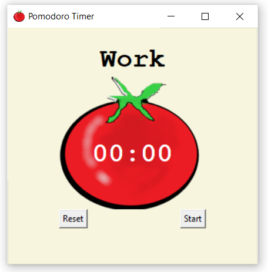

# ⏳ Pomodoro Timer – A Python Tkinter Pomodoro Timer App

**Pomodoro Timer** is a lightweight, distraction-free timer tool built to help you stay focused and productive using the Pomodoro technique.  
It’s designed to be simple, intuitive, and beginner-friendly — perfect for daily workflow, deep focus sessions, and mindful productivity.

---

**The Mission:**  
The app encourages users to break work into focused intervals followed by short breaks, improving efficiency and reducing burnout.  
It’s a personal productivity companion designed to keep you on track and help you build better habits.

---

## 💻 Download for Windows

🔗 [[Download Now!]](https://github.com/mshikebkhan/pomodoro-timer/releases/tag/v1.0.0)

---

## 🚀 Features

⏱️ Start and Reset – Simple and intuitive controls to begin or restart a session.  
🔔 Pomodoro Timing – 25-minute focus sessions with the option to reset anytime.  
🧠 Minimal Design – Clutter-free UI focused on clean user experience.  
📦 Lightweight – Small `.exe` size, no installation required.  
🖥️ Standalone App – Runs directly on Windows with no setup.

---

## 📸 Screenshots

| Screenshot | Description |
|------------|-------------|
|  | Main Timer Window |

---

## 🛠 Tech Stack

- **Language:** Python  
- **GUI:** Tkinter  
- **Build Tool:** PyInstaller

---

## ⚙️ Local Setup

```bash
git clone https://github.com/yourusername/pomodoro-pulse.git
cd pomodoro-pulse
python -m venv venv
venv\Scripts\activate         # For Windows
pip install -r requirements.txt
python main.py
```
---

## 👥 Contributing

1. Fork the repository
2. Create your feature branch: `git checkout -b feature-name`
3. Commit your changes
4. Push to your branch
5. Open a Pull Request 🚀

---

## 📌 TODO Ideas

- Add clicking sounds to buttons
- Add an alarm when the timer ends

---

## 📄 License

[MIT License](LICENSE)

---

Made with ❤️ by Shikeb Khan
